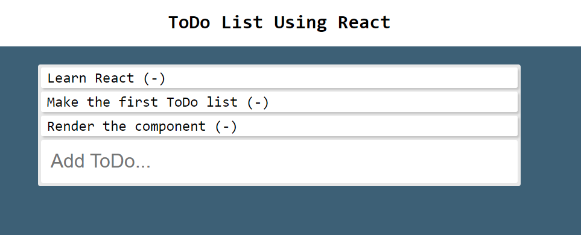

# ToDo-list-react

## Description
This simple ToDo app created using the REACT library. This app will let you add items to a ToDo list. This repository features the usage of REACT, JavaScript, CSS 
styling for looks and object placement. After you finish typing your item in the box below "Add ToDo...", press the ENTER key to see your item added to the list. You 
can enter as many item as you'd like.

How to use: Once the repository is deployed (https://dfgav1r1a.github.io/ToDo-list-react/) this simple ToDo app will be loaded. You will have a box where you can type 
the item that you would like to include in your ToDo list. To include the item, please hit the ENTER key on your keyboard. You will see that an item will 
appear at the bottom of the ToDo list. To delete an item from the list, simply click on the item you want to delete.

## Improvement Roadmap
1) Add a history panel where the user could see previous items.
2) Add a "Done" feature to the app.

